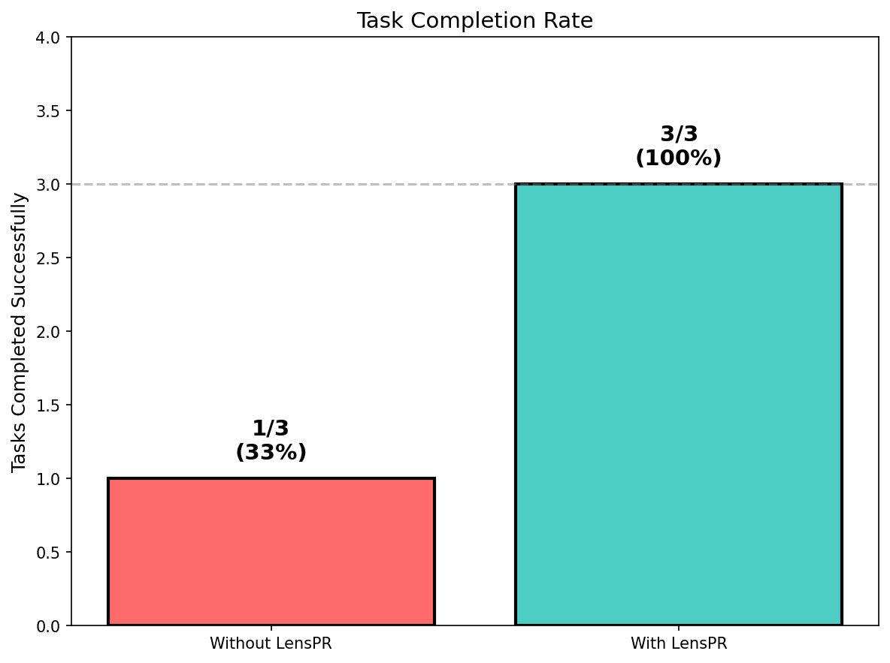
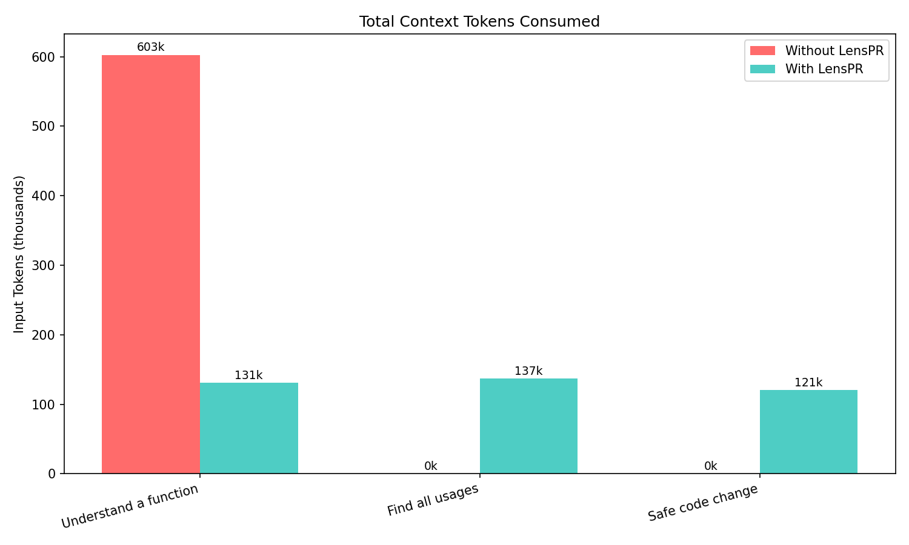

# LensPR

**LensPR makes Claude 3x more efficient by representing code as a graph.**

Instead of grep/read loops, Claude gets structured tools: one `lens_context` call returns function source + callers + callees + tests.


| Metric | Without LensPR | With LensPR | Improvement |
|--------|----------------|-------------|-------------|
| **Task Completion** | 33% (1/3) | 100% (3/3) | **+200%** |
| **Tokens Used** | 1.27M | 388K | **-70%** |
| **API Calls** | 84 | 38 | **-55%** |

---

> **This is a learning project.** I'm experimenting with LLM-assisted code development.
> Don't judge too harshly if something doesn't work!
>
> **Want to help?** [Open an issue](https://github.com/kyrylopr/lenspr/issues) to discuss!

---

## Quick Start

### Step 1: Install

```bash
# Recommended: full installation with all features
pip install 'lenspr[all]'

# Or minimal (Python + MCP only)
pip install 'lenspr[mcp]'
```

### Step 2: Initialize on your project

```bash
cd ./my_project
lenspr init .                   # Parses Python + TypeScript/JS files, builds graph
lenspr setup .                  # Creates .mcp.json config for Claude Code
```

> **Monorepo?** LensPR auto-detects package.json files in subdirectories.
> Use `--install-deps` to auto-install npm dependencies:
> ```bash
> lenspr init . --install-deps   # Auto-runs npm install in each JS/TS package
> ```

> **JS/TS projects need `jsconfig.json`** for good resolution (80%+).
> If you don't have one, create a minimal config:
> ```bash
> cat > jsconfig.json << 'EOF'
> {"compilerOptions":{"baseUrl":".","jsx":"react-jsx"},"include":["src/**/*"]}
> EOF
> ```

> **Re-initializing?** Use `lenspr init . --force` or delete the `.lens/` folder first.

### Step 3: Restart VSCode

Close VSCode completely (Cmd+Q / Alt+F4) and reopen your project.
Claude Code will now have access to `lens_*` tools.

### Step 4: Use it

**In Claude Code** — just ask:
- "What does my_function do?"
- "What calls validate_user?"
- "Check impact of changing Settings class"

**From CLI:**
```bash
lenspr status .                 # Show graph stats
lenspr search . "validate"      # Find functions by name
lenspr impact . my.function     # Check what breaks if you change it
```

## How It Works

```
Source Files (.py, .ts, .tsx, .js, .jsx)
       ↓
   Parsers:
   - Python: AST + jedi (96%+ resolution)
   - TypeScript/JS: tree-sitter + TS Compiler API (90%+ resolution)
       ↓
   SQLite Graph (nodes + edges)
       ↓
   Tools (29 MCP tools for Claude)
       ↓
   Safe Modifications (3-level validation)
```

LensPR parses code into a directed graph:
- **Nodes** = functions, classes, methods, modules
- **Edges** = calls, imports, inheritance, uses

Claude gets structured tools to navigate and modify code safely.

## Key Features

| Feature | Description |
|---------|-------------|
| **Impact Analysis** | Know what breaks before you change anything |
| **Architecture Analysis** | Detect patterns (Facade, Strategy, Factory), analyze components |
| **33 MCP Tools** | Navigation, search, analysis, modification, git, architecture |
| **3-Level Validation** | Syntax → Structure → Signature checks |
| **Atomic Modifications** | File changes roll back if graph sync fails |
| **Auto-Sync** | Graph updates automatically (50ms poll + 200ms debounce) |
| **Auto-Indentation** | Patches auto-adjust to match target indentation |
| **Monorepo Support** | Auto-detects packages, --install-deps for npm install |
| **Semantic Annotations** | Hybrid approach: Claude writes summaries, patterns detect roles |
| **Git Integration** | Blame, history, commit scope analysis |

## All CLI Commands

```bash
lenspr init <path>              # Build the code graph (auto-detects monorepos)
lenspr init <path> --install-deps  # Also runs npm install for JS/TS packages
lenspr setup <path>             # Create .mcp.json for Claude Code
lenspr status <path>            # Show graph stats (nodes, edges, confidence)
lenspr doctor <path>            # Diagnose project configuration issues
lenspr search <path> "query"    # Search functions/classes by name
lenspr impact <path> <node_id>  # Check what breaks if you change a node
lenspr sync <path>              # Resync after file changes
lenspr serve <path>             # Start MCP server manually
lenspr watch <path>             # Auto-sync on file changes
lenspr annotate <path>          # Show annotation coverage
lenspr architecture <path>      # Analyze patterns and components
```

## Python API

```python
import lenspr

# Initialize
lenspr.init("./my_project")

# Get full context in one call
context = lenspr.handle_tool("lens_context", {
    "node_id": "app.utils.validate_email"
})
# Returns: source + callers + callees + tests

# Check what breaks before changing
impact = lenspr.check_impact("app.models.User")
# Returns: severity, affected nodes, test coverage

# Search by name or code content
results = lenspr.handle_tool("lens_search", {
    "query": "validate",
    "search_in": "name"
})
```

## MCP Tools Overview

### Navigation & Search
| Tool | Description |
|------|-------------|
| `lens_context` | **Best tool** — source + callers + callees + tests in one call |
| `lens_get_node` | Get full source code of a node |
| `lens_search` | Search by name, code content, or docstring |
| `lens_grep` | Regex search with graph context |
| `lens_find_usages` | All callers, importers, inheritors |
| `lens_get_structure` | Project overview (use `mode="compact"` for large projects) |

### Analysis & Safety
| Tool | Description |
|------|-------------|
| `lens_check_impact` | **Always call before modifying** — shows severity |
| `lens_validate_change` | Dry-run validation without applying |
| `lens_health` | Graph quality: nodes, edges, confidence % |
| `lens_dead_code` | Find unreachable code (auto-detects framework entry points) |
| `lens_dependencies` | External packages used |

### Modification
| Tool | Description |
|------|-------------|
| `lens_update_node` | Update with validation + warnings |
| `lens_add_node` | Add new function/class |
| `lens_delete_node` | Remove a node |
| `lens_rename` | Rename across entire project |
| `lens_batch` | Multiple updates atomically |

### Git Integration
| Tool | Description |
|------|-------------|
| `lens_blame` | Who wrote each line |
| `lens_node_history` | Commits that modified this function |
| `lens_commit_scope` | What a commit affected |
| `lens_recent_changes` | Recently modified nodes |

### Semantic Annotations
| Tool | Description |
|------|-------------|
| `lens_annotate` | Get context for annotation |
| `lens_save_annotation` | Save summary (role auto-detected) |
| `lens_batch_save_annotations` | Annotate multiple nodes at once |
| `lens_annotation_stats` | Coverage statistics |

### Architecture Metrics
| Tool | Description |
|------|-------------|
| `lens_class_metrics` | Get pre-computed metrics for a class |
| `lens_project_metrics` | Get project-wide class statistics |
| `lens_largest_classes` | Get classes sorted by method count |
| `lens_compare_classes` | Compare metrics between multiple classes |
| `lens_components` | Analyze component cohesion and boundaries |

Full reference: [docs/TOOLS.md](docs/TOOLS.md)

## Auto-Sync

The graph syncs automatically **when MCP server is running**.

| Mode | Auto-Sync | How |
|------|-----------|-----|
| **Claude Code** | ✅ Yes | File watcher (50ms poll + 200ms debounce) |
| **CLI commands** | ❌ No | Run `lenspr sync .` manually |
| **`lenspr watch`** | ✅ Yes | Standalone watcher |

**Reliability guarantees:**
- Read operations (`lens_get_node`, `lens_search`, etc.) auto-sync before returning data
- Write operations (`lens_update_node`, etc.) are **atomic** — if graph sync fails, file is rolled back
- Patches auto-adjust indentation to match target location (methods in classes work correctly)

## Semantic Annotations

LensPR supports semantic annotations with a **hybrid approach**:
- **Claude** writes `summary` (requires semantic understanding)
- **Patterns** auto-detect `role` and `side_effects` (no hallucination)

### Example Node

```python
# Source code
def validate_email(email: str) -> bool:
    """Check if email is valid."""
    return "@" in email
```

```json
// Stored in graph
{
  "id": "app.utils.validate_email",
  "name": "validate_email",
  "type": "function",
  "file_path": "app/utils.py",
  "source_code": "def validate_email(...)",
  "signature": "def validate_email(email: str) -> bool",

  // Annotation fields
  "summary": "Validates email format by checking for @ symbol",
  "role": "validator",      // Auto-detected from "validate_" prefix
  "side_effects": []        // Auto-detected (none for this function)
}
```

### Available Roles

`validator` | `transformer` | `io` | `orchestrator` | `pure` | `handler` | `test` | `utility` | `factory` | `accessor`

### CLI Commands

```bash
lenspr annotate .                    # Show coverage
lenspr annotate . --auto             # Auto-annotate (role/side_effects only)
lenspr annotate . --auto --force     # Rewrite all annotations
lenspr annotate . --node <node_id>   # Annotate specific node
lenspr annotate . --file <path>      # Annotate all nodes in file
```

### Using Claude Code

For full annotations with summaries:

```
"Annotate my codebase"
```

Claude will call `lens_annotate_batch` → analyze code → call `lens_batch_save_annotations`.

## Architecture Metrics

LensPR computes class metrics during init/sync and provides raw data for Claude to interpret.

**Philosophy:** LensPR is a data provider, not a decision maker. It provides metrics - Claude decides what they mean.

### Available Metrics

| Metric | Description |
|--------|-------------|
| `method_count` | Total methods in class |
| `lines` | Lines of code |
| `public_methods` | Public method count |
| `private_methods` | Private method count (prefixed with _) |
| `dependency_count` | Number of external classes used |
| `internal_calls` | Methods calling other methods in same class |
| `method_prefixes` | Common prefixes (get_, set_, handle_, etc.) |
| `percentile_rank` | Position compared to other classes (0-100) |

### CLI Commands

```bash
lenspr architecture .                    # Show project metrics + largest classes
lenspr architecture . --metrics          # Show project-wide statistics
lenspr architecture . --largest 10       # Show 10 largest classes
lenspr architecture . --components       # Show component cohesion metrics
lenspr architecture . --explain MyClass  # Show detailed metrics for a class
lenspr architecture . --json             # Output as JSON
```

### Example Output

```
PROJECT METRICS:
  Total classes: 145
  Methods: avg=8.2, median=5
  Range: 0 - 52
  Percentiles: p90=18, p95=28

CLASS METRICS (LensContext):
  Methods: 52
  Lines: 320
  Public/Private: 35/17
  Dependencies: 8
  Percentile rank: 99.3%
```

Claude interprets the data: a class at p99 with many dependencies might be a Facade or might need refactoring - context decides.

## Project Structure

```
lenspr/
├── __init__.py          # Public API
├── models.py            # Data classes (Node, Edge, etc.)
├── context.py           # LensContext — central state
├── database.py          # SQLite operations
├── graph.py             # NetworkX algorithms
├── patcher.py           # File patching
├── validator.py         # 3-level validation
├── architecture.py      # Metrics computation, component analysis
├── mcp_server.py        # MCP server (33 tools)
├── cli.py               # CLI entry point
├── parsers/
│   ├── base.py              # BaseParser interface
│   ├── python_parser.py     # Python AST + jedi
│   ├── typescript_parser.py # TypeScript/JS tree-sitter
│   ├── ts_resolver.py       # Python-based TS resolver (fallback)
│   └── node_resolver.py     # Node.js TypeScript Compiler API
├── helpers/
│   └── ts_resolver.js       # Node.js resolver script
└── tools/
    ├── navigation.py    # Search, list, context
    ├── analysis.py      # Impact, health, dead code
    ├── modification.py  # Update, add, delete, rename
    ├── annotation.py    # Semantic annotations
    ├── arch.py          # Architecture metrics tools
    ├── git.py           # Blame, history
    └── patterns.py      # Role/side_effects detection
```

Full architecture: [docs/ARCHITECTURE.md](docs/ARCHITECTURE.md)

## Project Status

| Metric | Value |
|--------|-------|
| Tests | 227 passed |
| Python Resolution | 96%+ |
| TypeScript Resolution | 90%+ |
| MCP Tools | 33 |
| CLI Commands | 11 |
| Python Support | ✅ Yes (AST + jedi) |
| JS/TS Support | ✅ Yes (tree-sitter + TypeScript Compiler API) |

<details>
<summary>Detailed benchmark results</summary>




| Task | Without | With | Status |
|------|---------|------|--------|
| Understand Function | 602K tokens | 131K tokens | Both passed |
| Find All Usages | 623K tokens | 137K tokens | With: passed, Without: failed |
| Safe Code Change | Rate limit | 121K tokens | With: passed, Without: failed |

Run yourself: `make benchmark`

</details>

## Dead Code Detection

`lens_dead_code` automatically recognizes framework entry points to reduce false positives:

| Framework | Recognized Patterns |
|-----------|---------------------|
| **Alembic** | `upgrade`, `downgrade`, `run_migrations_*`, `versions/*.py` |
| **Celery** | `@celery.task`, `@app.task`, `@shared_task` |
| **Pytest** | `@pytest.fixture`, `conftest.py` functions |
| **Django** | `/management/commands/`, `@receiver`, `admin.py` |
| **FastAPI/Flask** | `@app.route`, `@router.get`, route files |
| **Click/Typer** | `@click.command`, `@app.command` |
| **Pydantic** | `@validator`, `@field_validator` |
| **SQLAlchemy** | `@event.listens_for` |

## Known Limitations

- **Dynamic code** — `getattr`, `eval()` (Python), dynamic imports (JS) can't be fully tracked
- **Large projects** — not tested on >10k files
- **TypeScript requires Node.js** — Node.js 18+ needed for full type inference
- **Alpha stage** — expect rough edges

## Contributing

I especially welcome:
- **Other language parsers** — Go, Rust, Java (`BaseParser` interface is ready)
- **Bug reports** — even "this doesn't work" is helpful
- **Ideas** — what would make this useful for you?

## Installation Options

```bash
pip install lenspr               # Core only (Python parser)
pip install 'lenspr[mcp]'        # + MCP server for Claude
pip install 'lenspr[typescript]' # + TypeScript/JavaScript parser
pip install 'lenspr[dev]'        # + dev tools
```

### TypeScript/JavaScript Support

For TypeScript/JavaScript projects with full type inference (90%+ resolution confidence):

```bash
# 1. Install with TypeScript extra
pip install 'lenspr[typescript]'

# 2. Ensure Node.js 18+ is installed
node --version  # Should be v18.0.0 or higher

# 3. Initialize on your TS/JS project
cd ./my-react-app
lenspr init .
```

**Requirements:**
- Node.js 18+ (for TypeScript Compiler API)
- Project should have `tsconfig.json` or `jsconfig.json`
- For best results, install type definitions (`@types/*` packages)

**Resolution confidence:**
- **RESOLVED** (90%+): Cross-file function calls with full type inference
- **EXTERNAL**: Calls to npm packages (react, lodash, etc.)
- **INFERRED**: Fallback when type information unavailable

**Features:**
- Re-export chain following (`export { X } from './module'`)
- Default export detection (`import X from './module'`)
- Class inheritance resolution (`extends BaseClass`)
- Property/method type enumeration (`obj.method()`)

## License

MIT

---

**Questions?** [Open an issue](https://github.com/kyrylopr/lenspr/issues)
