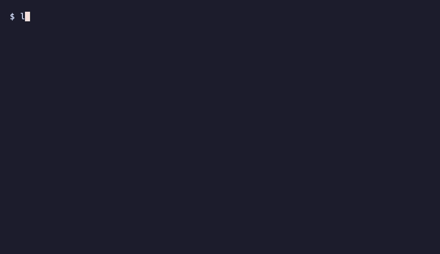

# LensPR

**Code intelligence for AI coding agents. Your AI sees dependencies before making changes.**

> Alpha (0.1.x) — works on real projects, used daily by the author. Expect rough edges.

AI assistants edit your code one file at a time. They don't see dependencies. They grep, read, guess — and break things three files away.

LensPR builds a dependency graph of your codebase and gives your AI structural understanding before it changes anything.

<!-- TODO: Add demo GIF here -->
<!--  -->

## Quick Start

Requires **Python 3.11+**, **macOS or Linux**. For TypeScript/JS projects, also **Node.js 18+**.

```bash
pip install 'lenspr[all]'
lenspr init .
lenspr setup .
```

Restart your IDE. Done. Your AI now has `lens_*` tools.

> Add `.lens/` to your `.gitignore` — the graph is local and rebuilt from source.

---

## What It Does

### "What depends on this function?"

One call returns source code, who calls it, what it calls, and related tests:

```
> lens_context("auth.login_handler")

source: 42 lines
callers: auth_routes.create_routes, test_auth.test_login_success
callees: db.get_user, crypto.verify_password, jwt.create_token
tests: test_login_success, test_login_wrong_password
```

Without LensPR your AI makes 5-7 grep/read calls and still misses things. With LensPR — one call, full picture.

### "What breaks if I change this?"

Before any modification, the AI sees the blast radius:

```
> lens_check_impact("models.User")

severity: CRITICAL
direct_dependents: 15
indirect_dependents: 23
affected_modules: auth, payments, notifications
tests_covering: 3
```

The AI warns you, changes its approach, or asks for confirmation. No more blind edits.

### "How healthy is this codebase?"

```
> lens_vibecheck()

score: 86/100 (B)
  test_coverage:    17/25 — 67% functions tested
  dead_code:        20/20 — 0% dead code
  circular_imports: 15/15 — 0 cycles
  architecture:     12/15 — 1 violation
  documentation:     8/10 — 81% documented
  graph_confidence: 14/15 — 94% edges resolved
```

Track whether the codebase is improving or degrading over time.

### Cross-language visibility

LensPR connects frontend and backend into a single graph:

```
LoginModal.tsx → fetch("/api/auth/login")
                        ↓ CALLS_API
Backend:  @router.post("/login") → login_handler()
            → db.query(User)        [reads: users]
            → verify_password()
            → create_jwt_token()
```

Also tracks: database tables, Docker services, env vars, CI/CD workflows, SQL migrations.

---

## Works With

| IDE | Setup |
|-----|-------|
| **Claude Code** | `lenspr setup .` — automatic |
| **Cursor** | Copy `.mcp.json` to `.cursor/mcp.json` |
| **Any MCP client** | `lenspr serve <path>` |

**Languages:** Python (95%+ resolution via Jedi/Pyright) and TypeScript/JavaScript (85-95% via tree-sitter + TS Compiler API).

**Infrastructure:** `.sql` files, Dockerfiles, `docker-compose.yml`, GitHub Actions workflows, `.env` files — all parsed into the same graph.

Everything runs locally. Your code never leaves your machine.

---

## Key Features

| | |
|---|---|
| **Impact Analysis** | Severity (LOW → CRITICAL) before any change |
| **One-Call Context** | Source + callers + callees + tests in one request |
| **Cross-Language** | Frontend HTTP → backend routes, DB tables, Docker, env vars, CI/CD |
| **Surgical Edits** | Targeted find/replace within a function — no full file rewrites |
| **Dead Code** | Find unreachable functions (Django, FastAPI, Celery entry points) |
| **Architecture Rules** | Enforce layer boundaries — violations warn before changes apply |
| **Git per Function** | Blame, history, commit scope at function level |
| **Session Memory** | AI picks up where it left off across context resets |
| **Auto-Sync** | File watcher updates graph on every save |
| **Health Score** | 0-100 score across 6 dimensions — track quality over time |

60+ tools organized in 12 groups — enable only what you need with `lenspr tools`.

<details>
<summary>All tools by category</summary>

**Navigation & Search (8):** `lens_context`, `lens_get_node`, `lens_search`, `lens_grep`, `lens_find_usages`, `lens_get_structure`, `lens_list_nodes`, `lens_get_connections`

**Modification (6):** `lens_update_node`, `lens_patch_node`, `lens_add_node`, `lens_delete_node`, `lens_rename`, `lens_batch`

**Analysis (6):** `lens_check_impact`, `lens_validate_change`, `lens_health`, `lens_dead_code`, `lens_dependencies`, `lens_diff`

**Quality (7):** `lens_vibecheck`, `lens_nfr_check`, `lens_test_coverage`, `lens_security_scan`, `lens_dep_audit`, `lens_fix_plan`, `lens_generate_test_skeleton`

**Architecture (9):** `lens_arch_rule_add`, `lens_arch_rule_list`, `lens_arch_rule_delete`, `lens_arch_check`, `lens_class_metrics`, `lens_project_metrics`, `lens_largest_classes`, `lens_compare_classes`, `lens_components`

**Git (4):** `lens_blame`, `lens_node_history`, `lens_commit_scope`, `lens_recent_changes`

**Infrastructure (5):** `lens_api_map`, `lens_db_map`, `lens_env_map`, `lens_ffi_map`, `lens_infra_map`

**Testing & Tracing (3):** `lens_run_tests`, `lens_trace`, `lens_trace_stats`

**Annotations (5):** `lens_annotate`, `lens_save_annotation`, `lens_batch_save_annotations`, `lens_annotate_batch`, `lens_annotation_stats`

**Session (4):** `lens_session_write`, `lens_session_read`, `lens_session_handoff`, `lens_resume`

**Temporal (2):** `lens_hotspots`, `lens_node_timeline`

**Explanation (1):** `lens_explain`

</details>

---

## Known Limitations

- **Windows** — not supported. macOS and Linux only.
- **`self.method()` calls** — static parser can't fully resolve instance method dispatch. Workaround: `lens_trace` (Python 3.12+) resolves these at runtime.
- **Go, Rust, Java** — not yet supported. Parser interface is ready for contributors.
- **Dynamic code** — `getattr`, `eval`, dynamic imports can't be tracked statically.

---

## Contributing

Try it. If it breaks, tell me.

- **Bug reports** — even "this doesn't work" is helpful
- **Language parsers** — Go, Rust, Java (BaseParser interface is ready)
- **Ideas** — [open an issue](https://github.com/kyrylopr/lenspr/issues)

## License

MIT

---

Built because AI kept breaking my code.
